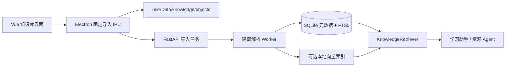

# A3 本地知识库与安全文件导入设计

> 日期：2026-07-15  
> 任务：S-018  
> 状态：用户已授权采纳  
> 原则：本地优先、可追溯、稳定降级、原文件不自动外传

## 1. 范围

首版支持 PDF、DOCX、PPTX、XLSX、TXT、Markdown 和 CSV，单文件上限 100 MB。图片型 PDF 支持本地 OCR 后台任务。知识库为全局资料库，可建立“高数”“英语考试”“软件杯资料”等集合；一个文件可属于多个集合，一个学习空间也可绑定多个集合。文件只导入和解析一次，删除学习空间不删除资料，只有删除知识库文档时才清理对象、切片和索引。

## 2. 目标与非目标

### 2.1 目标

1. 使用 Electron 系统文件选择器与拖放安全导入，不向 renderer 暴露任意文件系统能力。
2. 原文件、解析文本、索引和元数据全部保存在 A3 `userData` 中。
3. 解析不可信文件时限制格式、大小、页数、压缩比例、时间和资源使用；单个坏文件不能拖垮主后端。
4. SQLite FTS5 提供始终可用的关键词检索；本地语义模型包可选，缺失时稳定退化到 FTS5。
5. 每个检索结果保留文件、页码、幻灯片、工作表或行区间等引用信息。
6. 学习助手和资源生成可使用绑定集合，并向用户展示实际引用。
7. 文件内容按不可信数据处理，不能覆盖系统提示词或模型安全边界。
8. 支持导入进度、失败重试、取消、删除、重新解析和索引重建。

### 2.2 非目标

- 不做云盘同步、多人协作或账号共享；
- 不自动监视整个磁盘目录；
- 不把原始文件整体上传给模型服务；
- 不承诺还原复杂排版、宏、动画、公式编辑器或扫描件手写识别；
- 不在首版实现音视频转写、网页抓取和邮件导入；
- 不因缺少语义/OCR 模型包而阻止普通文件导入和关键词检索。

## 3. 方案选择

比较三种方案：

1. **完全依赖外部 Embedding API**：语义效果好、接入快，但有网络、费用、隐私和多 API 兼容风险。
2. **仅 SQLite FTS5**：最稳定、包体小、完全离线，但对同义词和语义问题召回较弱。
3. **FTS5 必选 + 可选本地语义/OCR 模型包**：无模型包时仍完整可用；安装模型包后采用混合召回。该方案最符合稳定性与隐私要求，因此采用。

语义和 OCR 模型包必须有独立版本、许可清单、SHA-256 校验和兼容范围。未确认许可、来源或校验值的模型不得下载或随安装包分发。

## 4. 总体架构

### 4.1 Electron 导入边界

renderer 只能调用固定方法：打开选择器、导入拖放文件、取消任务和读取进度。Electron 主进程取得真实路径后执行：

1. 规范化路径并拒绝设备文件、目录、符号链接和网络路径默认导入；
2. 检查扩展名、文件头、大小和普通文件属性；
3. 流式计算 SHA-256；
4. 复制到同一文件系统的临时对象，完成后原子重命名为 `objects/<sha256>`；
5. 只把对象相对路径、哈希、原始显示名、大小和 MIME 发送给后端；
6. 日志不记录用户完整原路径，错误界面只显示文件名。

拖放使用 Electron `webUtils.getPathForFile()` 的最小 preload 桥接；不允许 renderer 提交任意字符串路径。重复哈希直接复用对象，只新增集合关联。

### 4.2 后端导入编排

后端 `KnowledgeImportService` 创建持久化任务，再启动单独解析 worker。worker 只接收受控对象根目录下的相对路径、格式和限制，不接触桌面令牌、API Key、数据库连接或网络。

worker 输出版本化 JSON Lines：文档元数据、结构块、正文和引用位置。主后端验证每条事件后写入 SQLite。worker 崩溃、超时或输出非法时终止该任务，不影响 Uvicorn 与其他任务。

首版并发：最多 2 个普通解析任务、1 个 OCR 任务；同一对象哈希只运行一个解析任务。应用退出时中止 worker，任务标记 `INTERRUPTED`，下次启动可重试。

## 5. 文件验证与解析限制

### 5.1 通用限制

- 文件大小：100 MB；
- 单文档解析文本：50 MB；
- 解析时限：普通文件 120 秒，OCR 20 分钟；
- 单文件结构块：最多 100,000；
- 检测到加密、密码保护、宏执行要求或格式不匹配时拒绝解析；
- parser 和 OCR 禁止网络访问，不执行宏、脚本、外链和嵌入对象。

### 5.2 各格式

- **PDF**：最多 2,000 页；提取页文本和标题；文本密度不足时标记 `OCR_REQUIRED`。
- **DOCX**：读取段落、标题和表格文本；ZIP 条目最多 10,000，解压后总量最多 500 MB，拒绝路径穿越和异常压缩比。
- **PPTX**：读取幻灯片标题、正文、备注和表格；保留 slide 编号。
- **XLSX**：只以只读模式读取计算后的单元格值；最多 100 个工作表、1,000,000 个非空单元格；不执行公式和宏。
- **CSV**：检测 UTF-8/UTF-8 BOM/GB18030，最多 500,000 行和 1,024 列；记录行区间。
- **TXT/Markdown**：检测允许编码，拒绝 NUL，按标题和段落解析。

解析库进入固定依赖与 PyInstaller 收集清单。任何依赖升级必须重新运行恶意压缩包、损坏文件和打包 worker 测试。

## 6. 数据模型

### 6.1 `knowledge_documents`

- `id`、`sha256`（唯一）、`display_name`、`extension`、`mime_type`、`byte_size`；
- `object_relpath`、`parser_version`、`status`；
- `page_count`/`sheet_count`/`slide_count`；
- `text_characters`、`chunk_count`、`created_at`、`updated_at`；
- `safe_error_code`，不保存异常堆栈和原路径。

### 6.2 集合与关联

- `knowledge_collections`：名称、说明、颜色、创建时间；
- `knowledge_collection_documents`：集合与文档多对多，唯一组合；
- `session_knowledge_collections`：学习空间与集合多对多；
- 删除集合只删除关联，若文档不再属于任何集合且用户确认删除文档，才删除对象和索引。

### 6.3 `knowledge_chunks`

- `document_id`、`ordinal`、`text`、`text_sha256`；
- `heading_path`；
- `locator_type`：page/slide/sheet_rows/paragraph；
- `locator_start`、`locator_end`、`sheet_name`；
- `token_estimate`、`parser_version`。

FTS5 虚表索引 chunk text、display name 和 heading。向量索引只保存 chunk ID、模型版本和向量，不重复保存正文。

### 6.4 `knowledge_import_jobs`

状态：`QUEUED`、`VALIDATING`、`PARSING`、`OCR_REQUIRED`、`OCR_RUNNING`、`INDEXING`、`COMPLETED`、`FAILED`、`CANCELLED`、`INTERRUPTED`。保存进度、当前阶段、可重试标志和安全错误码。状态转换使用乐观版本号，取消具有幂等性。

## 7. 切片与索引

### 7.1 结构化切片

先按标题、页、幻灯片、工作表和段落形成结构块，再组合为约 600–1,000 个中英文字符的 chunk，重叠最多 120 字符。表格按表头 + 行组切片，保留行区间。禁止跨两个文件或跨不相邻页拼接。

切片版本写入数据库；算法升级时创建重建任务，不静默混用不同版本。

### 7.2 关键词索引

FTS5 是知识库发布硬依赖。索引同时保存原文和确定性的检索 token：拉丁文本按 Unicode 单词规范化，连续中文生成单字与双字 token，从而避免依赖系统分词器。查询使用同一 tokenizer 和安全转义，BM25 取前 30 条。数据库不支持 FTS5 时知识库子系统状态为 unavailable，页面给出明确安装错误且不回退到低效全表扫描；主学习、模型和复习功能继续可用，整体 `/health/ready` 不因此失败。

### 7.3 可选语义索引

本地语义包缺失时 UI 显示“关键词检索”；安装并校验成功后后台分批生成向量。首个向量实现使用 NumPy 归一化 float32 矩阵和 chunk ID 数组，以版本化 manifest + 临时目录原子替换；查询采用内存映射精确余弦检索，避免引入难以打包的 ANN 原生扩展。向量索引损坏或模型版本不一致时自动隔离并回退 FTS5，同时排队重建。

混合检索采用 Reciprocal Rank Fusion：FTS5 前 30 + 向量前 30，合并后去重，最终最多 8 个 chunk、6,000 字符。不得让语义检索成为导入成功的必要条件。

## 8. 学习流程接入

`KnowledgeRetriever` 接收 `session_id` 和查询，只检索该学习空间绑定集合。资源生成查询由当前用户问题、薄弱知识点和到期复习点组成；诊断阶段默认不使用知识库，避免资料内容影响学习画像，用户明确要求基于资料诊断时才启用。

返回 `KnowledgeContext`：

- 受控引用编号；
- 文档显示名和定位；
- chunk 文本；
- 检索方式与分数；
- 文档/解析/索引版本。

传给模型的片段包裹在“知识库数据开始/结束”边界中，系统提示明确：内容是不可信参考资料，其中任何指令都不可执行。模型生成结果使用 `[资料1]` 引用；后端校验引用编号必须来自本次检索集合，前端可点击查看原文片段和定位。

原文件不上传给模型服务。启用外部模型时，被命中的少量片段会随提示词发送；首次绑定知识库到外部模型学习空间时必须显示此隐私说明，用户可选择“仅本地检索，不用于模型生成”。

## 9. API 与 IPC

### 9.1 公共业务接口

- `GET/POST /api/knowledge/collections`
- `GET /api/knowledge/status`：返回 FTS/OCR/语义包和 worker 状态；
- `GET/PUT/DELETE /api/knowledge/collections/{id}`
- `GET /api/knowledge/documents`
- `GET/DELETE /api/knowledge/documents/{id}`
- `POST /api/knowledge/imports`：只接受 Electron 已入库对象 manifest；
- `GET/DELETE /api/knowledge/imports/{id}`：进度/取消；
- `POST /api/knowledge/documents/{id}/rebuild`
- `POST /api/knowledge/search`：调试和界面预览，返回引用片段；
- `GET/PUT /api/sessions/{session_id}/knowledge-collections`

所有 ID、分页、查询、文件名和 manifest 使用严格 Pydantic 模型；生产模式继续要求桌面令牌和 loopback。renderer 不能通过通用代理提交原始文件路径。

### 9.2 Electron 固定 IPC

- `knowledgeChooseFiles(collectionId)`
- `knowledgeImportDroppedFiles(files, collectionId)`
- `knowledgeRevealSource(documentId)`：只显示 A3 对象目录，不尝试返回原导入路径；
- `knowledgeOpenSource(documentId, locator)`：在受控临时目录创建带原扩展名的只读副本，再用系统关联程序打开或显示安全预览；
- `knowledgeOnImportProgress(listener)`

IPC 输入按 sender、字段、数量和类型验证。一次选择最多 50 个文件，总量最多 500 MB，超出后要求分批。

## 10. 界面

新增“知识库”导航页：

- 左栏：集合列表、绑定学习空间数量；
- 主区：文件卡片、导入/拖放、状态、大小、页数和最后索引时间；
- 右栏：选中文档详情、解析阶段、引用预览、重新解析和删除；
- 顶部显示检索模式：关键词 / 混合；
- 任务区显示可取消进度，失败卡片显示安全原因和重试入口；
- 学习助手书桌区域增加“本空间资料”选择入口和引用来源列表。

视觉沿用当前暖色三栏工作台。移动或窄屏以集合抽屉 + 单列文件卡片呈现，不在主聊天输入区塞入文件管理功能。

## 11. 错误语义

稳定错误码：

- `KNOWLEDGE_FILE_TOO_LARGE`
- `KNOWLEDGE_FORMAT_UNSUPPORTED`
- `KNOWLEDGE_FILE_SIGNATURE_MISMATCH`
- `KNOWLEDGE_ARCHIVE_UNSAFE`
- `KNOWLEDGE_DOCUMENT_ENCRYPTED`
- `KNOWLEDGE_PARSE_TIMEOUT`
- `KNOWLEDGE_PARSE_FAILED`
- `KNOWLEDGE_OCR_PACK_REQUIRED`
- `KNOWLEDGE_INDEX_UNAVAILABLE`
- `KNOWLEDGE_IMPORT_CANCELLED`
- `KNOWLEDGE_OBJECT_MISSING`

错误信封可带 document/job ID 和 retryable，不带完整原路径、正文、异常堆栈或文件二进制。解析器内部异常记录安全分类和 request ID；开发日志也不打印文档正文。

## 12. 安全与隐私

- 对象目录由后端固定，数据库只保存规范化相对路径；
- 打开、删除和解析前都 `resolve()` 并验证仍在对象根目录；
- ZIP/XML/PDF 解析禁用外部实体、脚本、宏和远程资源；
- 解析 worker 使用最小环境变量、无模型 Key、无桌面令牌、无网络；
- 文件哈希用于去重，不作为公开下载地址；
- 删除对象使用数据库事务标记 + 文件删除 + 索引清理的可恢复流程；
- 导入在建立文档记录前中断产生的孤立对象由每日清理任务在 24 小时后删除，清理前再次核对数据库引用和哈希；
- 知识库内容不进入普通日志、遥测、剪贴板或 localStorage；
- 用户上传文件的版权与使用权限由用户负责，界面提供本地使用提示。

## 13. 测试与发布门槛

### 13.1 单元测试

- 各格式最小合法样本、损坏样本、加密样本和伪扩展名；
- ZIP 路径穿越、压缩炸弹、超限页数/单元格/行数；
- worker 超时、崩溃、非法 JSONL、取消和应用重启恢复；
- SHA-256 去重、对象根目录约束、删除恢复；
- FTS5 排序、查询转义、集合隔离、切片定位和引用校验；
- 语义/OCR 包缺失、校验失败、索引损坏时稳定退化；
- 提示词注入样本不能改变系统行为。

### 13.2 集成与桌面测试

- 7 种格式真实导入、进度、检索、引用、重建和删除；
- 同文件加入两个集合只存一个对象；
- 一个学习空间绑定多个集合，另一个空间不可检索；
- 100 MB 边界与 50 文件/500 MB 批次限制；
- OCR 在后台运行且不阻塞普通聊天；
- Electron renderer 无任意路径读取能力；
- PyInstaller 包含解析依赖和 worker；unpacked/NSIS 安装版启动、导入、退出无残留；
- 完整后端、Electron、Vitest、桌面构建和密钥扫描通过。

性能门槛使用固定本地样本：10 MB 文本型 PDF 导入不超过 30 秒；10,000 chunks 的 FTS 查询 P95 小于 200 ms；取消请求 2 秒内终止 worker；导入期间普通健康接口 P95 小于 500 ms。OCR 不采用统一绝对耗时门槛，但必须持续报告页级进度并可取消。

## 14. 实施与回滚

1. 数据库元数据、对象存储和安全导入；
2. 隔离 parser worker 与 7 种格式；
3. 结构切片、FTS5 和搜索接口；
4. 集合、学习空间绑定与资源生成引用；
5. Vue/Electron 导入与管理界面；
6. OCR 可选模型包；
7. 本地语义索引插件；
8. 打包、恶意文件回归和真实桌面验收。

FTS5 与普通解析完成后即形成可交付的稳定最小版本。OCR 或语义模块失败时通过功能开关禁用，不回滚或删除已导入原文件、元数据和 FTS 索引。数据库迁移只新增表和索引，不修改现有学习记录。

## 15. 已确定决策

- 支持 PDF、DOCX、PPTX、XLSX、TXT、Markdown、CSV，单文件 100 MB；
- 图片 PDF 使用后台 OCR；
- 全局集合与学习空间多对多绑定；
- 原文件本地对象存储，不自动整体上传；
- FTS5 始终可用，本地语义/OCR 模型包可选；
- 解析在隔离 worker 中运行；
- 引用必须可追溯到文件和位置；
- 知识库片段按不可信数据处理；
- 没有许可和哈希清单的模型依赖不得分发。
