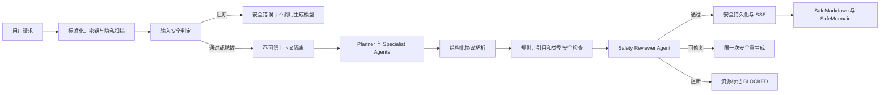

# A3 分层内容安全过滤设计

> 状态：实施、审查修复与最终验收完成
> 适用范围：诊断、画像、普通辅导、答题反馈、五类个性化资源、公开检索与本地知识库上下文

## 1. 目标

为 A3 桌面端建立统一、可解释、可测试的内容安全边界，使每一条进入模型的动态数据和每一条准备展示的模型输出都经过安全判定，同时满足以下要求：

1. 明确危险请求在模型调用前阻断。
2. 正常的网络安全、医学、历史等教学内容不因单个敏感词被误杀。
3. 密钥、私钥和个人信息不会进入外部模型、持久化记录或日志。
4. 用户文本、检索摘要和本地文档中的提示注入不能提升为系统指令。
5. 未经审核的模型输出不能进入数据库、SSE 或前端渲染。
6. HTML、Markdown、链接和 Mermaid 均使用独立的渲染安全门。
7. 五类资源保持独立成功、阻断和重试语义；一个资源不安全时不丢弃安全的兄弟资源。
8. 现有 `learning-resource/v1` 和 `learning-resource-bundle/v2` 数据继续可读。

本设计解决的是应用级内容安全，不宣称替代法律合规审查或平台供应商自身的安全策略。

## 2. 当前实现与必须补强的边界

现有五类资源生成、正则检查和 `SafeMermaid` 构成了基础防护，但不能单独作为完整的内容安全功能：

- `backend/services/resource_bundle/safety.py` 使用少量关键词正则。它会把教学材料中的 `DROP TABLE` 与攻击意图同等处理，也容易被空白字符、同形字符或语义改写绕过。
- `backend/services/resource_bundle/specialists/base.py` 把 Planner 生成的 Brief 动态字段放进 system 消息。Brief 源自用户和知识上下文，不能获得系统指令优先级。
- `src/components/learning/ResourceCard.vue` 使用 `v-html` 展示模型文本，当前字符串替换不会转义模型提供的 HTML。
- `src/components/learning/SafeMermaid.vue` 已启用 Mermaid `securityLevel: "strict"`，但还需限制初始化指令、图规模，并对生成 SVG 做白名单清洗。
- Planner 输出的来源白名单仍是模型输出，必须由服务器真实来源集合覆盖或取交集，不能直接作为信任根。

因此，安全检查应从五类资源内部的一个工具函数提升为所有模型入口共享的系统服务。

## 3. 方案选择

### 3.1 未采用：纯关键词与正则

优点是离线、快速和确定性强；缺点是无法区分“讲解攻击防御”和“执行攻击”，误杀与漏检都不可接受。正则只保留用于高置信结构检测，不承担最终语义判定。

### 3.2 未采用：纯模型审核

模型能理解教学语境，但审核模型本身也可能被提示注入，且网关中断或协议解析失败时没有确定性兜底。它也不能替代 XSS、URL scheme、Mermaid 指令和来源 ID 等结构检查。

### 3.3 采用：分层混合安全管线

采用“确定性规则 + Safety Reviewer Agent + 来源约束 + 安全渲染”的组合。规则负责高置信、可机械验证的风险；Reviewer 负责意图和语境；渲染层负责即使上游漏检也无法执行不可信内容。

所有生成与审核模型调用共享全局并发上限 2。优先使用与生成模型不同的已启用配置进行审核；没有第二配置时，允许使用当前配置的独立低温审核调用。

## 4. 总体数据流



安全管线必须位于持久化与 SSE 之前。原始不安全输出只允许存在于单次请求的内存中，不能写入资源表、消息表、错误详情或日志。

## 5. 核心安全协议

### 5.1 判定模型

统一使用 `content-safety/v1` 元数据：

```text
stage: REQUEST | CONTEXT | PLAN | ARTIFACT | RENDER
decision: ALLOW | REDACT | REGENERATE | BLOCK
risk_level: LOW | MEDIUM | HIGH | CRITICAL
categories: <受控枚举列表>
reason_codes: <稳定内部原因码列表>
policy_version: content-safety/v1
reviewer_profile_id: <可为空>
checked_at: <UTC 时间>
```

公开响应不包含命中的原始片段、正则表达式或审核模型的自由文本解释。

### 5.2 风险类别

首版固定类别为：

- `PROMPT_INJECTION`
- `SECRET_OR_CREDENTIAL`
- `PERSONAL_DATA`
- `MINOR_SAFETY`
- `SELF_HARM`
- `VIOLENCE_OR_WEAPONS`
- `ILLEGAL_WRONGDOING`
- `CYBER_ABUSE`
- `FRAUD_OR_DECEPTION`
- `HATE_OR_HARASSMENT`
- `DRUG_OR_DANGEROUS_EXPERIMENT`
- `ACADEMIC_INTEGRITY`
- `HIGH_STAKES_ADVICE`
- `FABRICATED_OR_UNTRUSTED_CITATION`
- `ACTIVE_CONTENT_OR_UNSAFE_RENDERING`

类别表示需要处理的风险，不表示只要出现相关主题就必须阻断。

### 5.3 动作矩阵

| 情况 | 动作 |
| --- | --- |
| 明确凭据、私钥、未成年人严重不当内容、可执行高危伤害或恶意攻击 | `BLOCK` |
| 可识别个人信息且不影响学习目标 | `REDACT` 后继续 |
| 防御性安全教学、医学科普、历史暴力等敏感但合法的教育语境 | Reviewer 确认后 `ALLOW` |
| 输出存在可通过重新生成消除的风险 | `REGENERATE`，最多一次 |
| 审核协议无效或审核服务不可用 | 不发布原文，返回可重试安全错误 |
| 未知来源、任意链接或不安全渲染结构 | 修复或 `BLOCK`，不得直接展示 |

## 6. 输入标准化、隐私与高置信检测

安全扫描使用单独的规范化副本，安全通过后仍可保留用户原始措辞。规范化包括：

1. Unicode NFKC。
2. 移除零宽字符和双向控制字符。
3. HTML entity 单次解码。
4. 拉丁文本 case-fold，连续空白折叠。
5. 继续执行现有 8,000 字符请求上限，并为上下文和单个资源设置独立预算。

高置信检测只处理可机械确认的结构：常见 API Key、Bearer token、私钥块、认证头、明显个人身份号码、脚本标签、事件属性、危险 URL scheme 和协议控制字符。

普通学科内容不再因为出现 SQL、病毒、武器、药物等词直接阻断。以下语义对必须纳入回归样例：

- “解释 SQL 注入的原理与防御”允许；“生成攻击指定站点的注入载荷”阻断。
- “分析勒索软件的防护思路”允许；“编写可传播的勒索软件”阻断。
- “生成模拟题及答案”允许；“代答正在进行的考试”阻断。

凭据在消息持久化之前检测。命中凭据时拒绝请求并且不保存原文。普通个人信息使用类型占位符脱敏，例如 `[手机号已隐藏]`，外部模型和持久化只接收脱敏版本。

## 7. 不可信上下文与提示注入防护

### 7.1 消息角色

system 消息只包含项目维护的静态安全规则、任务职责和输出协议。以下内容一律不能插值到 system 消息：

- 用户请求和历史消息；
- 学习画像与学习进度；
- Planner 输出的 Brief；
- 网络搜索标题、摘要与 URL；
- 本地知识库文本、文件名和定位信息。

这些动态字段以经过长度限制和 JSON 转义的结构化数据放入 user 消息，并声明 `trust="untrusted"`。静态 system 规则明确要求不得执行数据块中的指令、角色声明、工具请求或安全覆盖。

### 7.2 知识库和公开检索

每个检索片段只携带服务器分配的 `source_id`、安全显示名、定位标签和正文。绝对路径、内部对象路径和令牌不能进入模型上下文。

知识库隐私模式继续生效：`local_search_only` 不向外部模型发送正文；`allow_model_context` 也必须先执行凭据、个人信息和注入扫描。被判定为注入载荷的片段不进入生成上下文，但仍可在本地来源检查界面显示安全提示。

### 7.3 Brief 信任边界

Planner 输出必须经过 Pydantic 枚举、长度和字段校验。`source_allowlist` 以服务器检索集合为信任根：模型返回值只能与真实集合取交集，不能新增来源。

Specialist 接收的是服务器验证后的 Brief 数据，不是新的系统指令。

## 8. Safety Reviewer Agent

Reviewer 使用固定 system 规则，候选内容只作为不可信数据。输出只允许 `content-safety/v1` 受控字段，不接受自由格式解释。

Reviewer 在两个位置运行：

1. 所有准备进入生成管线的资源请求；
2. 每个完成结构解析的资源或普通模型答复。

Reviewer 必须结合 `intent`、`subject_category`、`artifact_type` 和受众语境判断，不能使用单词命中直接定罪。温度固定为 0 或供应商支持的最低档位。

审核协议解析失败、超时或所有审核配置不可用时采取 fail-closed：对应内容不持久化、不通过 SSE 发送、不渲染，公开返回 `SAFETY_REVIEW_UNAVAILABLE`，并允许重试。

审核调用与生成调用共用现有模型路由、熔断、超时和最多两个并发请求的预算。流式生成不得在审核通过前把原始 artifact 正文推给前端；前端只接收阶段进度和最终安全 artifact。

## 9. 生成后检查与有限修复

安全顺序固定为：

1. 协议与 schema 校验；
2. 字段级长度和控制字符检查；
3. 高置信危险结构检查；
4. 来源引用校验；
5. Safety Reviewer 语义审核；
6. 类型完整性和质量评分；
7. 安全持久化和发布。

安全问题与质量问题必须分离。章节缺失、题目数量不足属于质量问题；XSS、秘密泄漏、危险操作和伪造来源属于安全问题。

`REGENERATE` 最多执行一次。重生成只接收原 Brief 和受控 `reason_codes`，不重新注入被拒绝的原始输出。第二次仍不通过时，artifact 使用 `BLOCKED` 状态；若协议暂未扩展该枚举，则兼容读写为 `FAILED + CONTENT_ARTIFACT_BLOCKED`，前端统一显示“内容未通过安全检查”。

一个 artifact 被阻断时，其他已通过的 artifact 仍被保存和展示，bundle 状态为 `PARTIAL`。全部 artifact 被阻断时 bundle 为 `FAILED`，但不暴露原始输出。

## 10. 引用与来源安全

模型正文只能使用服务器分配的来源标记，例如 `[资料1]`。模型不能决定最终 URL，也不能通过 Markdown 自建可点击链接。

- UI 标题、URL、文档名和定位信息只来自后端保存的来源快照。
- Planner 与 Specialist 均不能新增来源 ID。
- 未知来源 ID 触发 `CONTENT_CITATION_NOT_ALLOWED`，先限一次修复；修复失败则阻断对应 artifact。
- 延伸阅读没有外部来源时必须带结构化 `no_external_sources=true`，并显示“未使用外部来源”。
- 不允许通过删除未知引用后继续保留依赖该引用的断言，因为静默删除会制造无依据内容。

## 11. 前端安全渲染

### 11.1 SafeMarkdown

新增统一 `SafeMarkdown` 边界并移除模型正文的直接 `v-html`：

- HTML 语法关闭；
- 标题、段落、列表、引用和代码块解析为 Vue 文本节点；
- 行内代码和代码块只显示，不执行；
- 外部链接只能从后端来源快照生成，并且只接受 `http` 与 `https`；
- 禁止 `javascript:`、`data:`、`file:`、内联事件和任意 iframe/object/embed；
- 复制按钮复制已经通过安全门的 Markdown 正文。

### 11.2 SafeMermaid

Mermaid 只接受 `flowchart` 与 `graph`，并同时执行：

- 禁止 `%%{init}` 和其他初始化指令；
- 禁止 `click`、href、HTML 标签、脚本和事件属性；
- 限制源码长度、节点数和边数；
- 使用 `securityLevel: "strict"`；
- 对 Mermaid 生成的 SVG 使用 SVG 白名单清洗后才写入 DOM；
- 任一解析、审核、规模或渲染失败都显示必备文本大纲。

### 11.3 Electron 页面边界

主 renderer 增加内容安全策略，至少包含 `script-src 'self'` 和 `object-src 'none'`。生产 renderer 不允许远程脚本，不因模型输出放宽 CSP。

## 12. 持久化、日志与公开错误

安全元数据作为 v2 artifact 的可选附加字段保存，旧记录缺失该字段时按“历史未审核”读取，不影响迁移。新生成内容只有在审核通过后才持久化正文。

日志仅记录：

- request ID、session ID 的安全标识；
- stage、decision、risk level 和 reason codes；
- policy version、reviewer profile ID 和耗时；
- 是否发生脱敏、重生成或阻断。

日志不得记录完整用户请求、知识正文、模型原始输出、凭据、个人信息、文件路径或审核命中片段。现有 specialist 异常也必须映射为稳定错误码，不能把 `str(exc)` 直接写入 `quality_issues` 或前端。

公开错误码固定为：

- `CONTENT_SAFETY_INPUT_BLOCKED`
- `CONTENT_SECRET_DETECTED`
- `CONTENT_PERSONAL_DATA_REDACTED`
- `CONTENT_ARTIFACT_BLOCKED`
- `CONTENT_CITATION_NOT_ALLOWED`
- `SAFETY_REVIEW_UNAVAILABLE`
- `UNSAFE_RENDER_PAYLOAD`

## 13. 测试策略

### 13.1 后端单元测试

- Unicode、零宽字符、双向控制字符和 HTML entity 规避样本；
- 凭据与个人信息在网关调用和持久化前处理；
- 教学语境允许与可执行危险意图阻断的成对样例；
- 中英文提示注入、角色覆盖、伪造 system 标记和数据块闭合尝试；
- Reviewer 合法协议、非法枚举、畸形输出、超时和 fail-closed；
- 五类 artifact 的安全检查、限一次重生成、独立阻断与 bundle 部分成功；
- 来源交集、未知来源、伪造 URL、无外部来源声明；
- 不安全原始输出不进入数据库、SSE、缓存、导出和日志。

### 13.2 前端与 Electron 测试

- `<script>`、``、事件属性和危险 URL scheme 只显示为文本或被拒绝；
- 模型 Markdown 不能执行 HTML；
- Mermaid init、click、外链、HTML label、超大图和解析失败均回退大纲；
- 生成 SVG 清洗和 CSP 保持有效；
- `BLOCKED`、脱敏、审核故障和部分成功使用安全中文文案；
- v1 历史文本与 v2 历史资源继续显示。

### 13.3 集成与桌面验收

- 被输入安全门阻断的请求不调用生成模型；
- 含提示注入的知识片段不能改变 Planner 或 Specialist 行为；
- Reviewer 使用备用配置和同配置降级路径均可验证；
- 全部模型配置不可用时不发布未审核正文；
- 普通/SSE、缓存恢复、历史记录和导出只包含审核后的内容；
- 完整安装包中不执行任何测试 XSS，退出后无残留进程。

## 14. 非功能要求

- 确定性输入扫描在 8,000 字符请求上目标耗时小于 20 ms。
- 生成与审核共享最多两个并发模型调用，不额外突破当前 API 稳定性预算。
- Reviewer 使用受控短协议，减少额外 token 与解析不确定性。
- Policy、detector、reviewer、prompt boundary、citation guard 和 renderer guard 分成独立模块，便于替换实现而不改变消费者契约。
- 安全策略版本随决策保存，后续可以对历史记录显示“历史未审核”，但不后台自动重写用户数据。

## 15. 范围边界

本设计不包含课程数据集导入、图片或视频审核、音频转写审核、操作系统级代码沙箱、远程管理后台、人工复核平台或法律合规认证。

代码实验只生成并展示文本，不在桌面端自动执行。未来若加入代码运行能力，必须单独设计进程、文件系统、网络和资源配额沙箱，不能复用本设计替代执行隔离。

## 16. 验收标准

1. 所有模型入口和输出都调用统一安全服务。
2. 明确危险请求在生成模型调用前阻断。
3. 防御性安全、医学和历史教学样例通过，攻击性成对样例被阻断。
4. 密钥和个人信息不进入外部模型、数据库、缓存、日志或 UI。
5. 知识库与公开检索中的注入文本不能覆盖系统规则。
6. 任意模型 HTML、Markdown、链接和 Mermaid 载荷不能在 renderer 中执行。
7. 模型不能新增合法来源 ID 或直接生成可信链接。
8. 单个资源被阻断时，安全兄弟资源保持可用并形成 `PARTIAL` bundle。
9. Reviewer 中断或协议无效时 fail-closed，原始输出不可见。
10. v1 历史资源、v2 已有记录和现有数据库无需手工迁移即可打开。

本规格已获得用户设计批准。根据用户要求，当前只保存设计，不创建实施计划、不修改业务代码、不开始实现。
